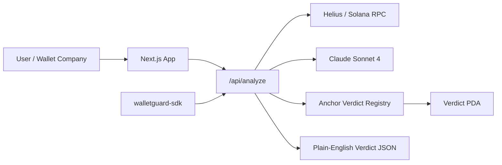

# WalletGuard AI

> AI-powered wallet risk analysis for Solana. Plain-English verdicts. Stored on-chain.

## The Problem

Solana users have no easy way to know if a wallet is a scammer, a dead wallet, or safe to interact with. Existing tools return raw data. WalletGuard explains it.

## How It Works

1. Fetch on-chain data: transactions, wallet age, token accounts, activity, flagged interactions.
2. Claude AI analyzes the patterns and returns a plain-English risk verdict.
3. Verdict can be stored on-chain via the Anchor Verdict Registry PDA.
4. Wallets and apps can embed the analysis through the `walletguard-sdk` package.

## On-Chain Program

Network: Solana Devnet

Program ID: `11111111111111111111111111111111`

[View on Explorer](https://explorer.solana.com/address/11111111111111111111111111111111?cluster=devnet)

Replace the placeholder ID after deploying `programs/walletguard` to devnet.

## SDK Integration

```bash
npm install walletguard-sdk
```

```typescript
import { analyzeWallet } from "walletguard-sdk";

const verdict = await analyzeWallet("WALLET_ADDRESS");
// { score: 74, label: "HIGH", verdict: "...", reasons: [...] }
```

## Architecture



## Local Setup

```bash
git clone https://github.com/YOUR/walletguard
cd walletguard
npm install
cp .env.example .env.local
npm run dev
```

Set the relevant keys in `.env.local`:

```env
HELIUS_RPC_URL=https://devnet.helius-rpc.com/?api-key=YOUR_KEY
ANTHROPIC_API_KEY=sk-ant-YOUR_KEY
NEXT_PUBLIC_PROGRAM_ID=YOUR_ANCHOR_PROGRAM_ID
NEXT_PUBLIC_SOLANA_NETWORK=devnet
```

Without `ANTHROPIC_API_KEY`, the app uses a deterministic local risk heuristic. Without a Helius key, it falls back to public devnet RPC and returns a provisional verdict if RPC is throttled.

## Pages

- `/` - Search-first homepage with demo wallets
- `/analyze/[address]` - Cinematic wallet verdict card
- `/bulk` - Bulk analyzer for up to 20 wallets
- `/watch` - Polling wallet watcher with live event log

## API

`POST /api/analyze`

```json
{
  "address": "WALLET_ADDRESS",
  "storeOnChain": true
}
```

`POST /api/watch`

```json
{
  "address": "WALLET_ADDRESS",
  "lastScore": 45
}
```

## Anchor

The Anchor program stores one PDA per analyzed wallet:

```text
seeds = ["verdict", analyzed_wallet]
```

The record stores wallet pubkey, score, label, timestamp, and bump.

## Built With

Next.js · TypeScript · Tailwind CSS · Framer Motion · Solana web3.js · Anchor · Claude AI · Helius RPC
